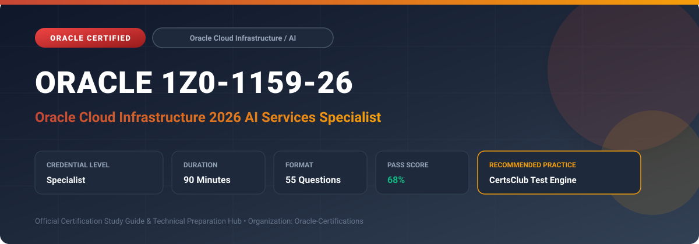

  

# Oracle 1Z0-1159-26: Oracle Cloud Infrastructure 2026 AI Services Specialist

---

## 1. Exam Overview & Candidate Profile

The **Oracle 1Z0-1159-26: Oracle Cloud Infrastructure 2026 AI Services Specialist** exam validates specialists who design, customize, and integrate OCI cognitive AI services into enterprise applications.

Candidates demonstrate technical capability across OCI Language (sentiment, NER, PII masking), OCI Vision (classification, object detection), OCI Speech (transcription), OCI Document Understanding, and OCI Anomaly Detection.

### Target Audience & Prerequisites
- **Target Roles**: Implementation Specialists, Cloud Architects, Technical Leads, Enterprise Consultants, and Systems Engineers.
- **Recommended Experience**: 1–2 years of practical, hands-on experience designing, implementing, and maintaining corresponding Oracle solutions.
- **Credential Earned**: Specialist Certification.

---

## 2. Key Exam Specifications

| Specification | Details |
| :--- | :--- |
| **Exam Code** | **Oracle 1Z0-1159-26** |
| **Official Title** | Oracle Cloud Infrastructure 2026 AI Services Specialist |
| **Certification Track** | Oracle Cloud Infrastructure / AI |
| **Exam Duration** | 90 Minutes |
| **Number of Questions** | 55 Questions |
| **Passing Score** | 68% |
| **Question Format** | Multiple Choice (Single/Multiple Answer), Scenario-Based Questions |
| **Delivery Provider** | Oracle University / Pearson VUE (Online Proctored or Test Center) |
| **Recommended Practice Engine** | [CertsClub Oracle Practice Tests](https://www.certsclub.com/oracle/1z0-1159-26-dumps.html) |

---

## 3. Official Blueprint & Exam Domain Breakdown

The examination assesses candidate competencies across core functional domains weighted as follows:

| Domain Area | Weighting |
| :--- | :--- |
| **OCI Language & Text Analytics Integration** | `25%` |
| **OCI Vision (Image Classification & Object Detection)** | `25%` |
| **OCI Document Understanding & Form Processing** | `20%` |
| **OCI Speech & Audio Transcription Pipelines** | `15%` |
| **OCI Anomaly Detection & API Security Best Practices** | `15%` |

---

## 4. Deep Dive into Complex & Challenging Technical Topics

To secure a passing score on the 1Z0-1159-26 exam, candidates must master the following advanced concepts:

- Customizing OCI Language models: training custom Named Entity Recognition (NER) and custom text classification.
- Deploying OCI Vision custom models for visual quality inspection and barcode/text extraction.
- Extracting tables, key-value pairs, and line items from invoices, receipts, and identity documents using OCI Document Understanding.
- Configuring real-time and batch OCI Speech transcription with custom vocabularies and profanity filtering.
- Training multivariate time-series anomaly detection models using MSET2 algorithms in OCI Anomaly Detection.

---

## 5. Scenario-Based Demo & Practice Questions

### Question 1
An enterprise needs to automatically redact Personally Identifiable Information (PII) such as phone numbers, national IDs, and email addresses from customer support emails. Which OCI service provides this capability?

A) OCI Language PII Masking
B) OCI Network Visualizer
C) OCI File Storage Service
D) OCI Container Registry

- **Correct Answer**: `A) OCI Language PII Masking`  
- **Technical Explanation**: OCI Language includes native PII detection and masking capabilities that automatically identify and redact sensitive personal information from text streams.

---

### Question 2
Which algorithm underpins OCI Anomaly Detection to identify subtle operational anomalies across multiple correlated time-series sensor signals?

A) MSET2 (Multivariate State Estimation Technique)
B) Simple Linear Regression
C) K-Means Clustering
D) Naive Bayes

- **Correct Answer**: `A) MSET2 (Multivariate State Estimation Technique)`  
- **Technical Explanation**: OCI Anomaly Detection uses Oracle's patented MSET2 algorithm, which analyzes complex relationships across multiple sensor metrics to detect anomalies before catastrophic failure.

---

## 6. Recommended Preparation Strategy & Practice Testing Engine

Achieving certification in **Oracle 1Z0-1159-26** requires balanced theoretical study and scenario-based simulation practice:

1. **Review Oracle Documentation**: Master architecture guides, implementation workbooks, and administration manuals on the Oracle Help Center.
2. **Hands-on Lab Practice**: Execute real-world configuration, policy setup, and troubleshooting tasks in your cloud tenancy or test instance.
3. **Simulated Exam Drills**: Practice answering timed, scenario-based multiple-choice questions to familiarize yourself with the question formats, traps, and timing constraints.

### Practice With CertsClub
For realistic practice questions, updated dumps, and mock testing environments:
- **Resource**: [CertsClub Oracle Practice Test Engine](https://www.certsclub.com/oracle/1z0-1159-26-dumps.html)
- **Special Discount**: Use coupon code **`club20`** during checkout for an instant **20% discount** on all practice exam bundles and testing engines.

---

## 7. Official Documentation & References

- [Oracle University Certification Registry](https://education.oracle.com/)
- [Oracle Help Center Documentation Portal](https://docs.oracle.com/)
- [Oracle Cloud Infrastructure & Applications Guides](https://docs.oracle.com/en/cloud/)
- [CertsClub Oracle Certification Exam Practice](https://www.certsclub.com/oracle/1z0-1159-26-dumps.html)

---

## 8. SEO & Discovery Keywords

`oracle 1z0-1159-26, oracle 1z0-1159-26 exam, oracle 1z0-1159-26 dumps, 1Z0-1159-26 practice questions, 1Z0-1159-26 study guide, oracle cloud infrastructure 2026 ai services specialist, certsclub 1z0-1159-26`